<!-- GENERATED FILE — do not edit. Source: 02-organization/org-data/ ; regenerate with tools/generate_org_views.py -->

# Org Chart — Buildout Status

Generated 2026-07-27 from `org-data/`. Box color = seat status; `n in play` = active candidates targeting the seat. (The ED-facing version is `dashboard.html`.)

```mermaid
flowchart TD
    secretary["Secretary of Commerce"]:::external
    ed["Executive Director<br/><i>On board · AMS</i>"]:::filled
    commerce_cos["Chief of Staff, Commerce<br/><i>On board · Yvette</i>"]:::filled
    commerce_gc["General Counsel, Commerce<br/><i>On board · Cooper Goodfrey</i>"]:::filled
    commerce_chief_counsel["Chief Counsel of Commerce<br/><i>On board · David Shapiro</i>"]:::filled
    commerce_cfo["CFO, Commerce<br/><i>On board · Prashanth</i>"]:::filled
    deputy["Deputy Director (acting)<br/><i>On board · Josh Kroon</i>"]:::filled
    head_investments["Head of Investments<br/><i>In screening · 1 in play</i>"]:::clearance_ethics
    inv_jacob["Investment<br/><i>On board · Jacob</i>"]:::filled
    inv_abhiram["Investment<br/><i>On board · Abhiram</i>"]:::filled
    inv_open["Investment Team<br/><i>In talks · 3 seats · 6 in play</i>"]:::interviewing
    gc["General Counsel (USIA)<br/><i>In talks · 2 in play</i>"]:::interviewing
    legal_tyler["Legal<br/><i>On board · Tyler</i>"]:::filled
    legal_iac["Legal<br/><i>On board · Iac</i>"]:::filled
    legal_assoc["Senior Associate — Legal<br/><i>Not started · 2 seats</i>"]:::defined
    paralegal["Paralegal<br/><i>Not started</i>"]:::defined
    research_matt["Research<br/><i>On board · Matt Petite</i>"]:::filled
    research_open["Research<br/><i>Sourcing · 2 seats · 2 in play</i>"]:::sourcing
    cos["Chief of Staff (USIA)<br/><i>Sourcing</i>"]:::sourcing
    ea["Executive Assistant<br/><i>Not started</i>"]:::defined
    adv_aron["Senior Advisor (SGE)<br/><i>On board · Aron</i>"]:::filled
    adv_sobel["Senior Advisor (SGE)<br/><i>On board · Jon Sobel</i>"]:::filled

    secretary -.-> ed
    secretary -.-> commerce_cos
    secretary -.-> commerce_gc
    secretary -.-> commerce_chief_counsel
    secretary -.-> commerce_cfo
    ed --> deputy
    ed --> head_investments
    ed --> inv_jacob
    ed --> inv_abhiram
    ed --> inv_open
    ed --> gc
    ed --> legal_tyler
    ed --> legal_iac
    ed --> legal_assoc
    ed --> paralegal
    ed --> research_matt
    ed --> research_open
    ed --> cos
    ed --> ea
    ed --> adv_aron
    ed --> adv_sobel

    classDef external fill:#ffffff,stroke:#666,stroke-dasharray: 4 3;
    classDef defined fill:#ececec,stroke:#9e9e9e,stroke-width:2px;
    classDef approved fill:#e3ecf7,stroke:#5b84b1,stroke-width:2px;
    classDef sourcing fill:#d6e6f7,stroke:#2f6db3,stroke-width:2px;
    classDef interviewing fill:#fdf0d2,stroke:#c99a2c,stroke-width:2px;
    classDef selected fill:#fde3c8,stroke:#d97b29,stroke-width:2px;
    classDef clearance_ethics fill:#eadff2,stroke:#7d5ba6,stroke-width:2px;
    classDef filled fill:#d8efd8,stroke:#2e7d32,stroke-width:2px;
    classDef hold fill:#f2d9d9,stroke:#a94442,stroke-width:2px;
```

