<!-- GENERATED FILE — do not edit. Source: 02-organization/org-data/ ; regenerate with tools/generate_org_views.py -->

# Org Chart — Buildout Status

Generated 2026-07-27 from `org-data/seats.yaml` and `org-data/candidates.yaml`. Box color = seat status; `n in play` = active candidates targeting the seat.

```mermaid
flowchart TD
    secretary["Secretary of Commerce"]:::external
    ed["Executive Director<br/><i>Filled · TBD — enter name</i>"]:::filled
    cos["Chief of Staff<br/><i>Defined</i>"]:::defined
    head_deals["Head of Deals<br/><i>Defined · 1 in play</i>"]:::defined
    head_toolkit["Head of Federal Toolkit & Structuring<br/><i>Defined</i>"]:::defined
    head_portfolio["Head of Portfolio Management<br/><i>Defined</i>"]:::defined
    dl_semis["Deal Lead — Semiconductors & AI Infrastructure<br/><i>Defined</i>"]:::defined
    dl_minerals["Deal Lead — Critical Minerals<br/><i>Defined</i>"]:::defined
    dl_energy["Deal Lead — Energy & Nuclear<br/><i>Defined</i>"]:::defined
    dl_pharma["Deal Lead — Pharma & Biomanufacturing<br/><i>Defined</i>"]:::defined
    dl_ship["Deal Lead — Shipbuilding & Defense Industrial Base<br/><i>Defined</i>"]:::defined
    origination["Origination & Screening Lead<br/><i>Defined</i>"]:::defined
    legal_counsel["Legal & Agreements Counsel<br/><i>Defined · 2 seats</i>"]:::defined
    permitting["Permitting & Regulatory Lead<br/><i>Defined</i>"]:::defined
    incentives["Incentives & Instruments Specialist<br/><i>Defined · 3 seats</i>"]:::defined
    chips_portfolio["CHIPS Portfolio Lead<br/><i>Defined</i>"]:::defined
    equity_portfolio["Equity & Special Positions Lead<br/><i>Defined</i>"]:::defined
    ops_admin["Operations & Administration Lead<br/><i>Defined</i>"]:::defined
    analytics["Strategy & Analytics<br/><i>Defined · 2 seats</i>"]:::defined
    liaison["Interagency & State Liaison<br/><i>Defined</i>"]:::defined
    ext_affairs["External Affairs<br/><i>Defined</i>"]:::defined

    secretary -.-> ed
    ed --> cos
    ed --> head_deals
    ed --> head_toolkit
    ed --> head_portfolio
    head_deals --> dl_semis
    head_deals --> dl_minerals
    head_deals --> dl_energy
    head_deals --> dl_pharma
    head_deals --> dl_ship
    head_deals --> origination
    head_toolkit --> legal_counsel
    head_toolkit --> permitting
    head_toolkit --> incentives
    head_portfolio --> chips_portfolio
    head_portfolio --> equity_portfolio
    cos --> ops_admin
    cos --> analytics
    cos --> liaison
    cos --> ext_affairs

    classDef external fill:#ffffff,stroke:#666,stroke-dasharray: 4 3;
    classDef defined fill:#ececec,stroke:#9e9e9e,stroke-width:2px;
    classDef approved fill:#e3ecf7,stroke:#5b84b1,stroke-width:2px;
    classDef sourcing fill:#d6e6f7,stroke:#2f6db3,stroke-width:2px;
    classDef interviewing fill:#fdf0d2,stroke:#c99a2c,stroke-width:2px;
    classDef selected fill:#fde3c8,stroke:#d97b29,stroke-width:2px;
    classDef clearance_ethics fill:#eadff2,stroke:#7d5ba6,stroke-width:2px;
    classDef filled fill:#d8efd8,stroke:#2e7d32,stroke-width:2px;
    classDef hold fill:#f2d9d9,stroke:#a94442,stroke-width:2px;
```

| Status | Meaning |
|---|---|
| Defined | Seat exists on paper only |
| Approved | Billet approved and funded; not yet recruiting |
| Sourcing | Building the candidate slate |
| Interviewing | Candidates in interviews |
| Selected | Selection made; pre-clearance |
| Clearance/Ethics | Selectee in clearance, ethics, or paperwork |
| Filled | Incumbent on board |
| On hold | Deliberately paused |
