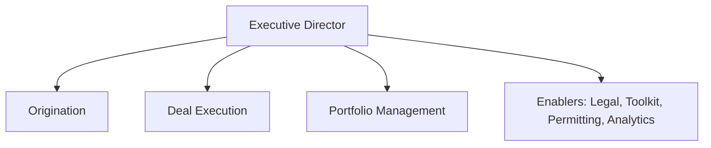
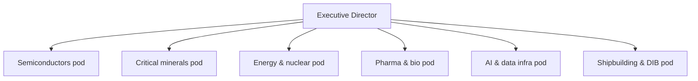
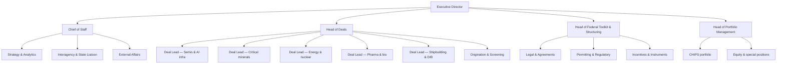

# Organization Design

## Design principles

1. **Deals are the product.** The org optimizes for deal velocity and quality;
   everything else is shared service to deal teams.
2. **Small senior teams beat large junior ones.** A deal team is 2–4 people with
   authority, drawing specialists as needed — investment-bank staffing, not
   agency staffing.
3. **The toolkit is a discipline, not tribal knowledge.** Knowing every federal
   instrument and how to stack them is a dedicated function, not something each
   deal team rediscovers.
4. **Portfolio stewardship is separate from deal-making.** The people negotiating
   the next deal should not also be the only ones monitoring the last one —
   different skills, different incentives.

## Three models considered

### Model A — Functional

Teams organized by function: Origination, Execution, Portfolio, Enablers.

- **Pro:** clear career paths, easy to run at small size, no duplicated specialists.
- **Con:** handoffs between origination and execution lose deal context; nobody owns
  a sector end-to-end; sector expertise stays shallow.

### Model B — Sector pods

Self-contained teams per sector (semiconductors, critical minerals, energy/nuclear,
pharma/biomanufacturing, AI & data infrastructure, shipbuilding & defense industrial base).

- **Pro:** deep sector expertise, end-to-end ownership, natural counterpart for
  industry and agencies.
- **Con:** at current headcount each pod is 1–2 people; specialists (legal, permitting,
  incentives) get duplicated or starved; uneven deal flow leaves pods idle or drowning.

### Model C — Hybrid (recommended)

Sector-aligned deal leads on a shared spine of specialist functions. Deal teams are
assembled per deal: a sector deal lead + specialists assigned from the spine.

- **Pro:** sector depth where it matters (the deal lead), efficiency where it matters
  (shared specialists), scales smoothly — add deal leads as flow grows, thicken the
  spine as the portfolio grows.
- **Con:** matrix tension between deal leads and function heads. Mitigation: the deal
  lead always owns the deal; function heads own quality of their discipline and
  people development, never deal decisions.

## Why C, in one paragraph

The Accelerator's work is lumpy and sector-concentrated: a handful of very large,
very different deals at once. Model A breaks deal ownership at exactly the moments
that matter; Model B can't be staffed honestly at current size. Model C mirrors how
principal-investing organizations actually run — sector partners, shared execution
infrastructure — and it degrades gracefully: at 15 people it's a team with hats,
at 50 it's the chart above, without reorganizing in between.

## Scaling path

| Stage | ~Headcount | What exists |
|---|---|---|
| Today → Phase 0 | 10–15 | ED, CoS, 3–4 deal leads wearing multiple hats, 1–2 toolkit/legal, analytics |
| Phase 1 | 20–30 | All function heads named; each priority sector has a dedicated deal lead; permitting lead hired |
| Phase 2 | 35–50 | Origination team distinct from execution; portfolio management staffed; 2–3 people per major sector |
| Phase 3 | 50–60 (cap) | Full chart; deputies/successors identified for every critical seat |

Deliberately capped: past ~60 the office starts behaving like a program agency
instead of a deal team. Growth beyond that should be pushed into the agencies that
own the instruments.

## Interfaces (who the org must connect to, by name)

- **Upward:** Secretary's office; NEC/NSC for priority-setting on Tier 1 deals
- **Instrument owners:** DOE (LPO, MESC), DoD (OSC, DPA Title III, IBAS), Treasury
  (tax policy), EXIM, DFC, USDA, DOT, HHS/BARDA, SBA
- **Regulatory:** Federal Permitting Improvement Steering Council (FAST-41), EPA,
  Army Corps, relevant independent agencies
- **Within Commerce:** CHIPS Program Office (internal), EDA, ITA/SelectUSA, NIST, BIS
- **External:** state economic development authorities; allied-government investment
  offices; the transaction ecosystem (banks, law firms) as counterparties

Each interface gets a named owner inside the org — see `roles-and-hiring.md`.
