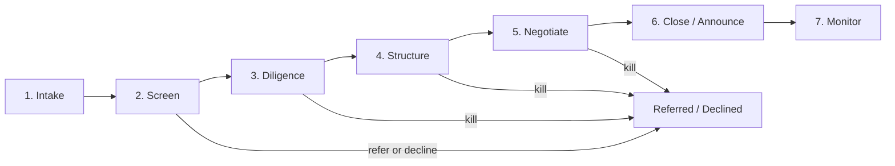

# Deal Lifecycle, Stage Gates & Operating Cadence

A shared vocabulary for where every deal stands, what must be true to advance, and
which artifact carries each decision. The one-pager (`04-templates/`) displays the
stage; this document defines it.

## Lifecycle

## Stage definitions

### 1. Intake
- **What happens:** opportunity arrives via any origination channel; logged as a
  deal record within 48 hours, however thin.
- **Owner:** Origination & Screening.
- **Exit criteria:** enough information to score — investor, sector, rough size,
  what they want from the government.

### 2. Screen
- **What happens:** scored against the strategic importance framework
  (`05-frameworks/strategic-importance-scoring.md`); tier assigned; go / refer / decline.
- **Artifact:** screening one-pager (abbreviated template).
- **Decision:** Head of Deals accepts into pipeline and assigns a deal lead;
  Tier 1 designation confirmed by ED.
- **Exit criteria:** named deal owner, tier, and a defined "what would make this
  deal real" question list. Declines get a referral destination (EDA, SelectUSA,
  state, other agency) — "no" always lands somewhere.

### 3. Diligence
- **What happens:** deal team validates the investment case: investor credibility
  and balance sheet, project feasibility, site status, what federal action is
  actually necessary vs. nice-to-have, competitive/market reality.
- **Artifact:** full one-pager, first complete version; diligence memo if Tier 1.
- **Exit criteria:** the team can state the deal's binding constraint (capital cost?
  permitting? offtake certainty? workforce?) — because the package targets it.

### 4. Structure
- **What happens:** Toolkit function designs the federal package: which instruments,
  from which agencies, in what sequence, at what cost, against which milestones.
  Instrument-owner agencies consulted; state incentives layered in.
- **Artifact:** package memo (decision-memo template) with options and a
  recommendation; leverage ratio computed.
- **Decision:** ED endorses package; Secretary approves for Tier 1 or wherever
  equity/special terms are involved.
- **Exit criteria:** approved negotiating envelope — what we offer, what we require,
  where we walk.

### 5. Negotiate
- **What happens:** term sheet to definitive agreements; interagency commitments
  locked in writing; announcement plan prepared.
- **Exit criteria:** signed agreements + announcement approved.

### 6. Close / Announce
- **What happens:** public announcement; obligations documented; handoff package
  from deal team to Portfolio Management (terms, milestones, contacts, risks).
- **Rule:** no deal closes without a completed handoff package — the deal team's
  job isn't done until Portfolio can steward it without them.

### 7. Monitor
- **What happens:** milestone tracking, position management, escalation of trouble.
  Quarterly portfolio review rolls up to the Secretary.

## Cadence

| Meeting | Freq | Chair | Content | Artifact |
|---|---|---|---|---|
| Pipeline review | Weekly | Head of Deals | Every active deal: stage, next decision, blockers; aging flags | Pipeline dashboard |
| Deal team stand-ups | Per deal, 2–3x/wk | Deal lead | Working session | — |
| Toolkit clinic | Weekly | Head of Toolkit | Package design for deals in Structure | Draft package memos |
| ED deal session | Weekly | ED | Tier 1 deals + any deal needing an ED decision | One-pagers |
| Secretary review | Monthly | ED | Tiered pipeline, decisions needed, announcements upcoming | Briefing book (auto-generated, see `07-systems/`) |
| Portfolio review | Quarterly | Head of Portfolio | Milestones, positions, problems | Portfolio report |
| Sector strategy | Quarterly | Each sector lead | Chokepoint map refresh, target list, origination plan | Sector one-pager |

## RACI for a Tier 1 deal

| Activity | Deal lead | Head of Deals | Toolkit | Portfolio | ED | Secretary |
|---|---|---|---|---|---|---|
| Screening & tiering | C | R/A | C | — | A (Tier 1) | I |
| Diligence | R/A | C | C | — | I | — |
| Package design | C | C | R | — | A | A (Tier 1/equity) |
| Negotiation | R/A | C | C | — | C | A (terms) |
| Announcement | C | C | — | — | R | A |
| Monitoring | C (yr 1) | I | — | R/A | I | I |

## Process rules

1. **Every deal is always in exactly one stage.** No "sort of in diligence."
2. **Stage changes happen at the pipeline meeting**, recorded in the deal record —
   that's what makes the dashboard trustworthy.
3. **Aging is visible.** Each stage has an expected dwell time; deals past it get
   flagged automatically, not by memory.
4. **Kills are decisions, not fades.** A killed deal gets a one-line rationale in
   the record — the precedent library is built from these too.
5. **The record is the source of truth.** If it isn't in the deal record, it didn't
   happen — this is what makes the Codex automation in `07-systems/` possible.
