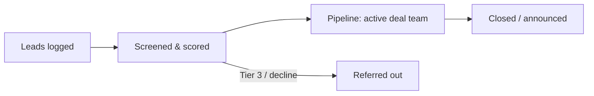

# Origination Analysis

Where deals come from, who owns each channel, how the funnel is measured, and how
the office moves from reactive (processing inbound) to proactive (making the deals
it wants exist). The two-year test of origination maturity: at least one closed deal
that started as a row in a chokepoint map, not as an inbound call.

## Channels

| Channel | Description | Owner | Posture |
|---|---|---|---|
| **Directive** | White House / NSC / NEC / Secretary priorities handed down | ED → Head of Deals | Reactive by nature; make intake instant |
| **Agency referral** | DOE, DoD, Treasury, EXIM, etc. surface deals needing cross-government assembly | Interagency Liaison | Cultivate: agencies refer more when referrals come back well-served |
| **Corporate inbound** | Companies approaching the front door | Origination & Screening | Triage fast; most inbound is Tier 3 or referral |
| **Foreign-partner capital** | Allied-government and sovereign investment pledges seeking deployment | Dedicated senior owner | High-touch; pledges convert to projects only with active matchmaking |
| **Sector screening** | Top-down: chokepoint maps → target lists → outreach | Sector deal leads | The proactive engine; see below |
| **Reshoring / trade-driven** | Companies restructuring supply chains around tariff and trade exposure | Origination + ITA | Systematize: watch announced capex plans, approach early |
| **State pipelines** | State EDAs with mega-projects needing a federal layer | Interagency Liaison | Standing channel with top ~10 project states |

## Funnel & metrics

| Metric | Why it matters |
|---|---|
| Leads by channel per quarter | Which channels actually produce; where to invest coverage |
| Screen rate & time-to-disposition | Front-door credibility — target: every inbound dispositioned in 2 weeks |
| Screen → pipeline conversion by channel | Channel quality, not just volume |
| Pipeline → close rate & cycle time | The machine's real throughput |
| Referral outcomes | Whether "no" lands well — protects the front door's reputation |
| % pipeline originated top-down | The proactivity ratio; should rise every quarter |

## Sector screening method (the proactive engine)

Per priority sector, quarterly, owned by the sector deal lead with Analytics:

1. **Chokepoint map.** Where does the supply chain depend on foreign — especially
   adversary-controlled — capacity? Quantify: import share, concentration, substitutes.
2. **Capability gap list.** Which chokepoints could plausibly be closed by a
   US-sited investment at Accelerator scale? (Some can't — say so explicitly.)
3. **Target list.** For each gap: which companies (domestic or allied) could build
   it, what would they need, what's blocking them today?
4. **Outreach plan.** Ranked targets, named owner, the opening conversation, and
   which federal tools would likely anchor a package.
5. **Refresh.** Deals close gaps; update the map, move to the next chokepoint.

The chokepoint map is also the strategic-importance evidence base — dimension 2
scores cite it.

## Intake standards (the front door)

- Single intake path, however the lead arrives — everything becomes a deal record
  within 48 hours (`04-templates/deal-record-schema.yaml`).
- A thin record beats a lost lead; Origination enriches before scoring.
- Every disposition is one of four: **pipeline** (owner assigned), **monitor**
  (ripeness date set), **refer** (named destination, warm handoff), **decline**
  (rationale logged).
- The decline log is reviewed quarterly — patterns in what we decline are strategy
  information.

## Channel-building moves for year one

1. Publish (internally, interagency) a one-pager on what the Accelerator takes and
   what it refers — agencies refer better when the aperture is explicit.
2. Set up the standing state channel: quarterly call with the top project states'
   EDA heads.
3. Assign the foreign-partner capital owner early — pledge-to-project conversion
   is slow and relationship-bound; starting late costs a year.
4. Instrument the funnel from day one, even in a spreadsheet — channel metrics
   argued from memory convince no one.
